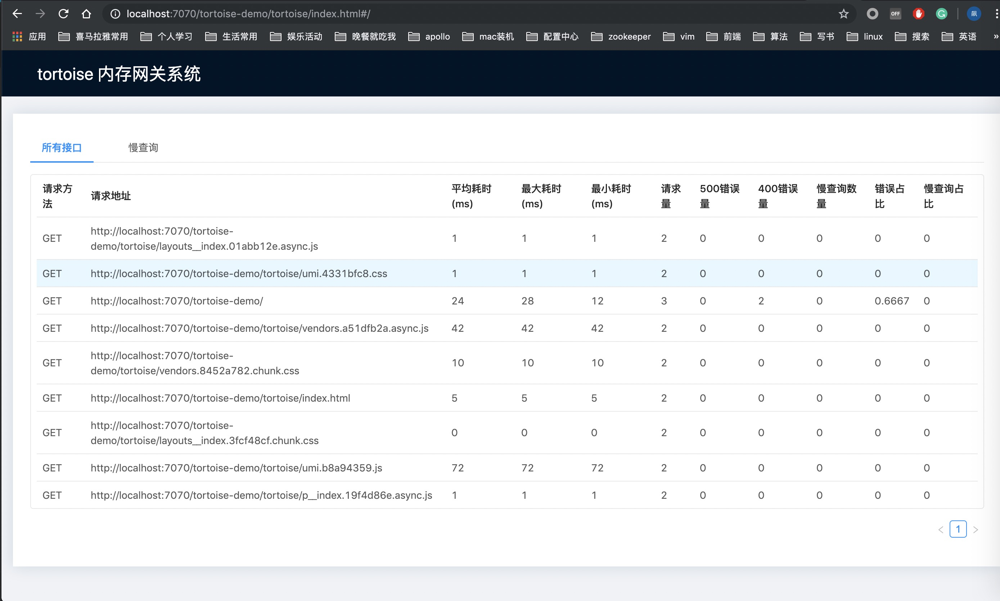

## Tortoise 基于内存请求监控系统
### 介绍
Tortoise是一个基于内存的请求监控系统。能够统计web项目每个请求的平均耗时，最大耗时。请求量。慢查询记录和报警等一些功能。方便个人开发者或者没有网关系统的小公司使用。该项目会持续迭代，加入更多的功能。

#### V 1.0
* 支持记录请求量，平均耗时，最长耗时，慢查询记录，超时异常报警。

#### V 1.1 待开发
* 当500异常时支持异常通知
* 支持接口QPS查看。
* 支持总调用量统计。
* url 支持搜索
* 慢查询保留1000条即可。


### 使用方法
该系统是通过拦截每次请求。将结果保存在内存里面。目前对系统性能的影响还未知。不建议高并发项目引入该jar包。

#### 第一步，引入maven依赖

```
   <dependency>
            <groupId>com.standup-tortoise</groupId>
            <artifactId>tortoise-core</artifactId>
            <version>1.0</version>
   </dependency>
        

```

#### 在 Web.xml里面添加Filter

```
    <filter>
        <filter-name>tortoiseFilter</filter-name>
        <filter-class>com.standup.tortoise.filter.TortoiseFilter</filter-class>

        <init-param>
            <param-name>slowQueryThreshold</param-name>
            <!-- 超时报警值，默认是ms -->
            <param-value>300</param-value>  
        </init-param>
        <init-param>
            <param-name>dingdingUrl</param-name>
            <!-- dingding机器人的回调地址 -->
            <param-value>https://oapi.dingtalk.com/robot/send?access_token=c75917ab24778d9a6396ecbd23555e74aeb07ac1e38438ab610ac665657b6622</param-value>
        </init-param>

    </filter>

    <filter-mapping>
        <filter-name>tortoiseFilter</filter-name>
        <url-pattern>/*</url-pattern>
    </filter-mapping>

```
#### 在 Web.xml里面添加Servlet
请确保Servlet的配置保证如下

```
  <servlet>
        <servlet-name>tortoiseServlet</servlet-name>
        <servlet-class>com.standup.tortoise.servlet.TortoiseServlet</servlet-class>
    </servlet>

    <servlet-mapping>
        <servlet-name>tortoiseServlet</servlet-name>
        <url-pattern>/tortoise/*</url-pattern>
    </servlet-mapping>

```

#### 启动项目 输入链接即可打开监控页面如下

http://域名/contextPath/tortoise/index.html




### 参与开源

如果想参与该项目的研发，可以在仓库提交issue，想参与开发。我会主动联系你的。该项目急缺前端开发工程师参与。